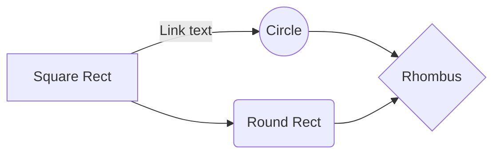
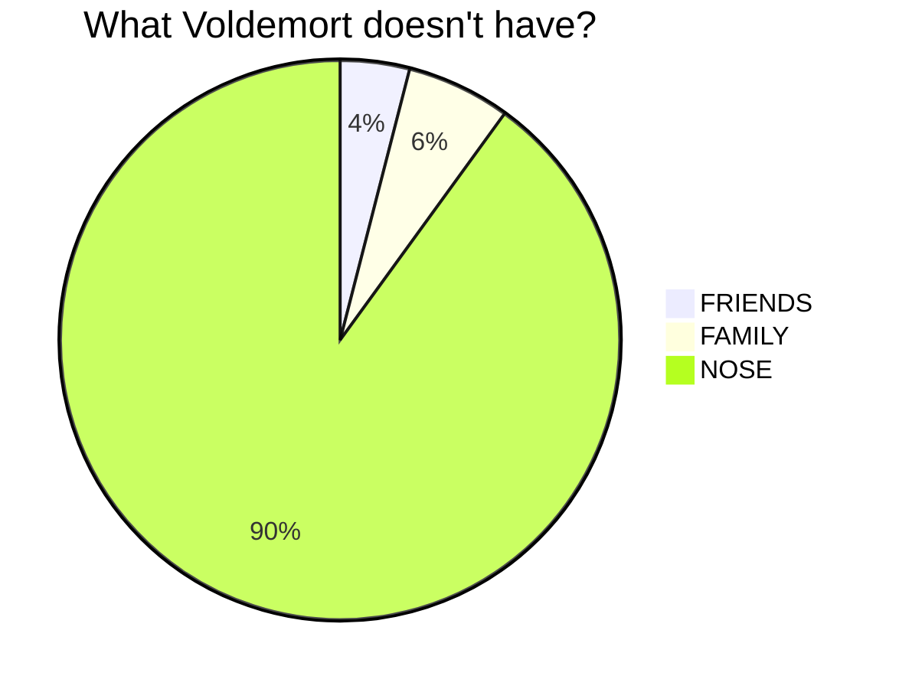
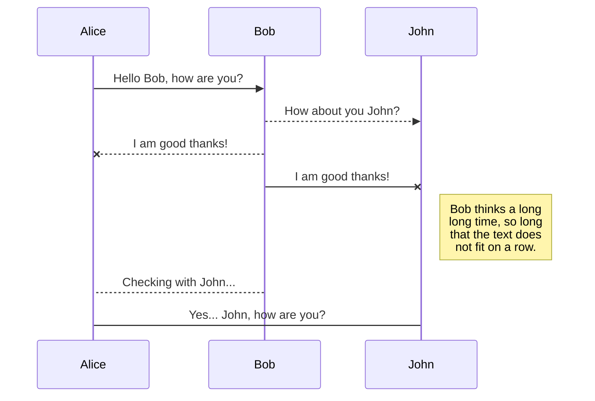
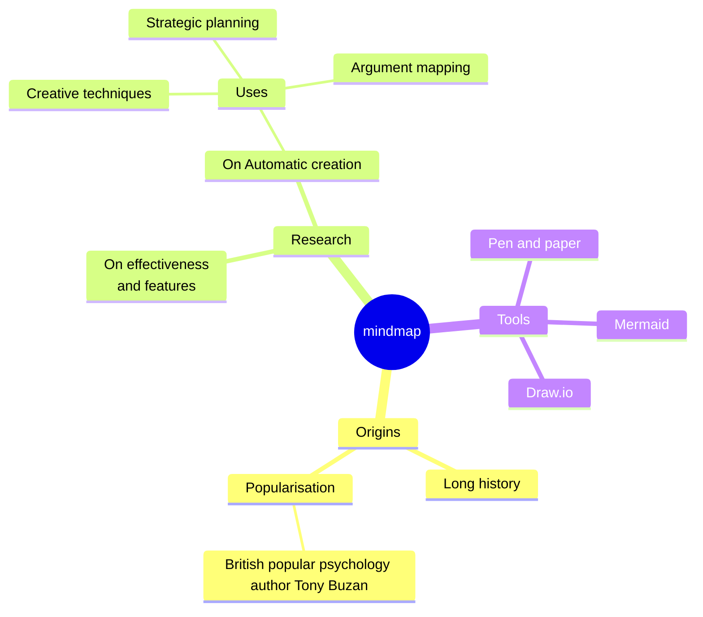
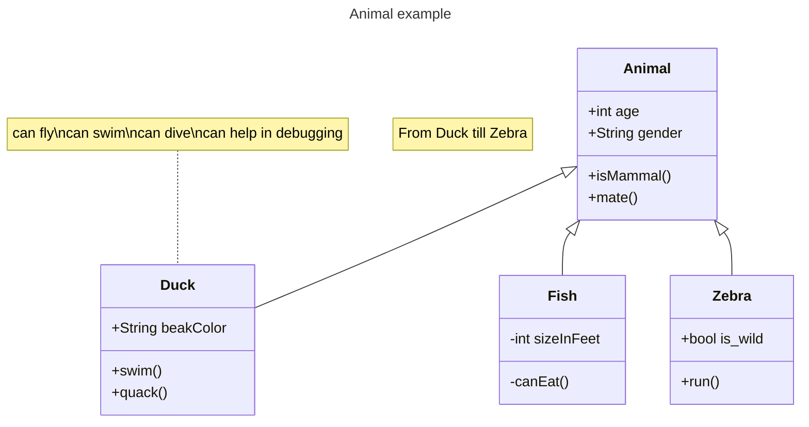
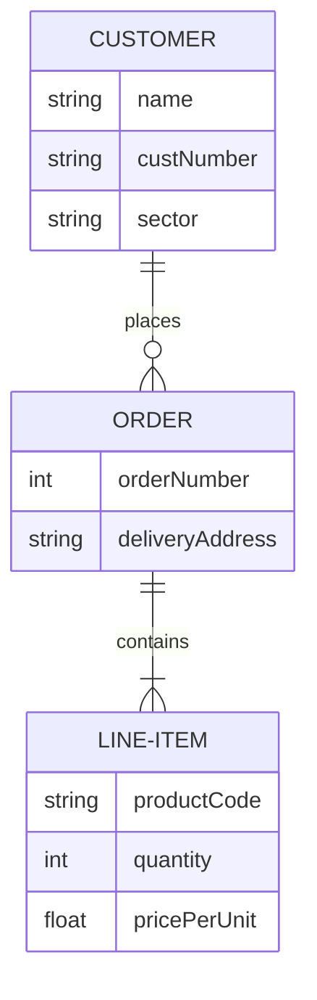
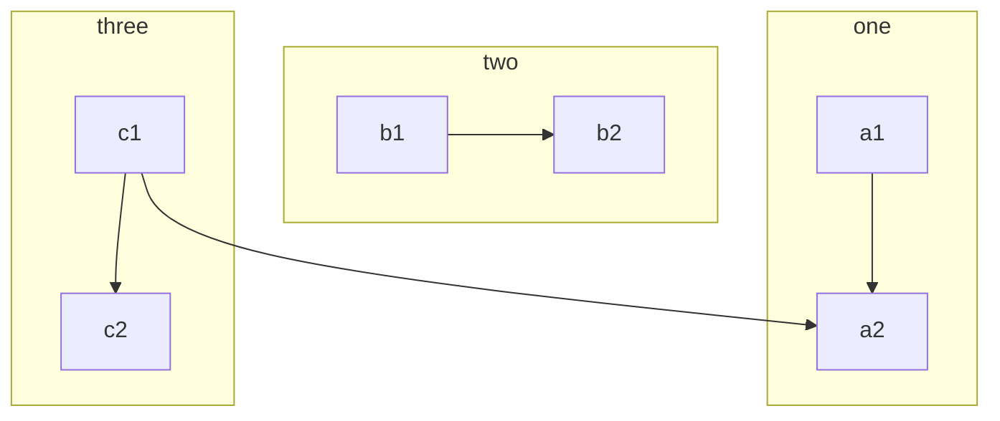

# Mermaid samples

Simple top down diagram.

Left to right diagram:

Pie chart diagram:

Sequence diagram:

Mindmap diagram:

Class diagram:

Relationship types: 

Type  Description

<|--  Inheritance

*--	 Composition

o--	 Aggregation

-->	 Association

--	Link (Solid)

..>	 Dependency

..|>  Realization

..	Link (Dashed)

Entity relationship diagram:

Diagram with subraph (groups)

