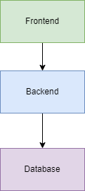

# Sample diagrams using mermaid and draw.io.

Do you want to easily create development documentation using screenshots and diagrams? 

This repository contains an introduction to great tools for adding diagrams and screenshots to markdown files. This makes an easy way to update documentation inside visual studio code. 

## Installation

Using these tools requires Visual Studio Code. 

Vscode addons:
- Markdown Preview Mermaid Support
- Mermaid Markdown Syntax Highlighting
- Draw.io Integration: Mermaid plugin
- Draw.io Integration (By Henning Dieterichs)
- Paste image (By mushan)

## Mermaid

Using Mermaid diagrams you can create visual models using Mermaid notation in Markdown files. 

These can be flow diagrams, class diagrams, mind maps and other types of diagrams. 

[Documentation reference](https://mermaid.js.org/syntax/examples.html)

More mermaid samples:

[MermaidSamples.md](MermaidSamples.md)

Samle top down diagram with flow descriptors:

When viewing markdown files in Azure DevOps repository, the Mermaid diagrams aren't rendered as visual models. But previewing markdown files in GitHub repositories does show the visual Mermaid diagrams. 

## Copy paste images to Markdown

When creating test cases or instructions, copying snippets and pasting images to Markdown files is a great help. 

Vscode addon:
- Paste image (By mushan)

Using the Paste image extension you place your marker in the Markdown file and press ctrl + alt + V. This creates a .png file with the image from the clipboard and saves the .png file with a timestamp (e.g. 2024-03-26-10-36-59.png). It also inserts a reference in the markdown, making the image visible in preview mode. 

The following sample is a pasted image. 

I like to place images in an "Images" folder and decide the filename when pasting images to markdown. In the Paste image extension settings, you can set the option: "Pate Image: Show File Path Confirm Input Box". When this is enabled, you will be asked for a path when pasting an image. 

Opening extension settings:

Navigate to vscode extensions, select the "Paste image" extension and click the gear icon, then select Extension settings.

Show File Path Confirm Input Box setting:

I also enable the option "Paste Image: Force Unix Style Separator". This saves images with a forward slash when saving images to subfolders. This makes the preview work in Azure DevOps or Github. 

For copying screenshots you can use standard windows 'Print screen' button. On a clean environment or a server, Paint brush is usually available. This can be used for clipping image and basic anotation. 

But I recommend using the OneNote clipping shortcut 'Shift + Windows key + S'. Used in combination wih the 'ctrl + alt + V' for pasting image, it is a quick way to copying and pasting images into Markdown files.

## Embedded Draw.io image file

For more advanced diagrams, draw.io is a great tool. Draw.io provides a canvas for adding and arranging elements much like Visio, but it is free to use. There is an installer on https://www.drawio.com/. Diagrams can be edited even without installing it locally. You can open https://app.diagrams.net/ in a browser, and edit and save your diagrams locally. This makes it very available for everyone to use and see your diagrams. 

The following Vscode extensions provides draw.io support. 

- Draw.io Integration (By Henning Dieterichs)

A cool way to embed draw.io diagrams in markdown files, are by renaming the drawing file from \<name\>.drawio to \<name\>.drawio.png. You can add the diagram to the markdown file like an image. See the following sample. 

Embedded diagram:

This way the diagram is rendered as an image file when viewing the mardown preview in Azure DevOps or in Github. When you edit the diagram locally you just have to open the \<name\>.drawio.png file and you can edit the draw.io diagram. You don't have to take a screenshot of the diagram and save it as a .png file. The image is automatically updated when you save the draw.io diagram. Pretty cool :-). 

## Draw.io integration: Mermaid plugin

With this extension, Mermaid shapes types are added to the Draw.io palette. Add a mermaid shape to the diagram, double click the shape to edit mermaid code. 

The following Vscode extensions provides draw.io Mermaid support.

- Draw.io Integration: Mermaid plugin (By Nopeslide). This allows you add Mermaid elements to your draw.io diagrams, which provides a diagram in diagram.

The editing experience:

Draw.io diagram as file png, containing a mermaid diagram shape:

There is a catch to the Mermaid shapes inside Draw.io. These doesn't have full Mermaid syntax support. If you write a Mermaid diagram in markdown and move it to a shape within draw.io, it might not render and give you an ugly error message. In this case you need to cleanup the Mermaid code, using the more basic Mermaid symbols. 

